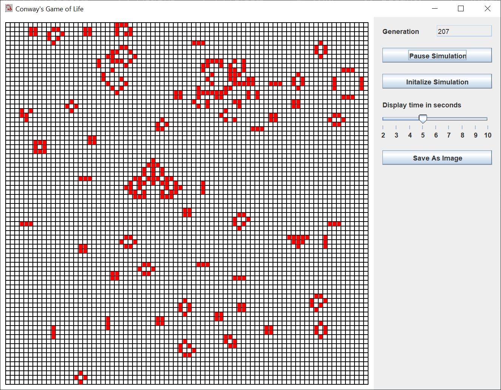
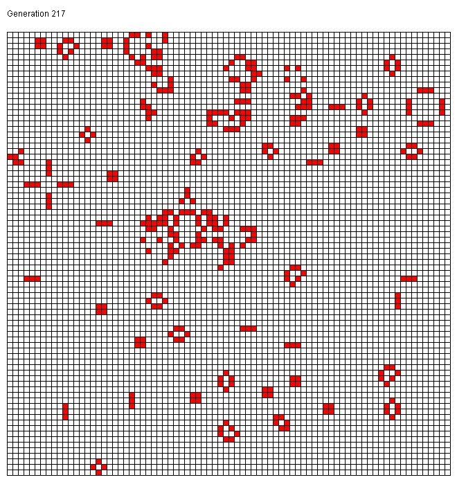
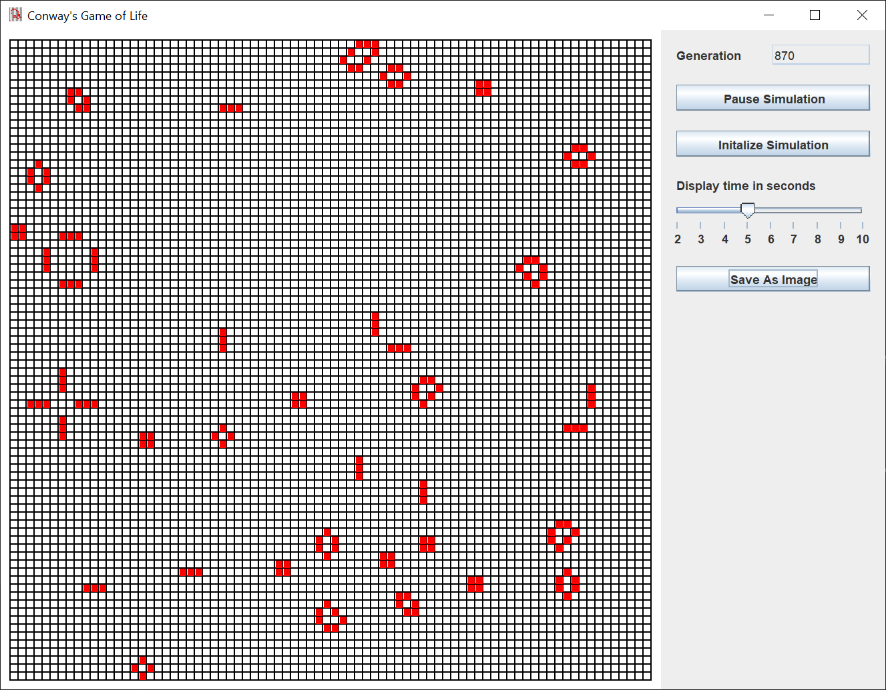

# Conway's Game of Life

## Introduction

From the [Wikipedia article](https://en.wikipedia.org/wiki/Conway%27s_Game_of_Life):

> The Game of Life, also known simply as Life, is a cellular automaton devised by the British mathematician John Horton Conway in 1970. It is a zero-player game, meaning that its evolution is determined by its initial state, requiring no further input. One interacts with the Game of Life by creating an initial configuration and observing how it evolves. It is Turing complete and can simulate a universal constructor or any other Turing machine.

If you’re not familiar with Java Swing, Oracle has an excellent tutorial to get you started, [Creating a GUI With JFC/Swing](https://docs.oracle.com/javase/tutorial/uiswing/index.html). Skip the Netbeans section.

I decided to write a Java Swing GUI to play the game.  Here is the GUI I created.

The 100 x 100 grid on the left shows living cells in red.  Each generation, cells live or die according to the following rules:

1. Any live cell with two or three live neighbors survives.
2. Any dead cell with three live neighbors becomes a live cell.
3. All other live cells die in the next generation. Similarly, all other dead cells stay dead.

The button controls on the right start, pause, resume, initalize, or save the grid as an image.  The slider control determines how long each generation is displayed in the GUI, from 2 to 10 seconds.

Here's what that image looks like:

## Explanation

I used the [model / view / controller](https://en.wikipedia.org/wiki/Model%E2%80%93view%E2%80%93controller) pattern when designing this Swing application.  This means, create the model first, then the view, then the controller classs.

The model consists of one plain Java class.  An application model can consist of multiple plain Java classes.

The view is made up of Swing components.  I use Swing components.  The only time I extend a Swing component, or any other Java class, is when I want to override one or more of the class methods.  The view reads information from the model, but does not update the model.

The controller is made up of five Java classes.  These classes act independently from each other, unless otherwise noted.  The controller classes update the model and update / repaint the view.

### Model

The model is a Set of Point instances.  Only the living cells are kept in this Set.  The advantages to using a Set are two-fold:

1. Only the living cells are stored.  The dead (empty) cells don't need to be stored.
2. Living cells can be created outside of the grid display bounds.  Those living cells are not displayed, but they are used in determining which cells live or die.

The inital state of the game is randomly created live cells making up to 20% of the grid size.  Living cells tend to clump together in stable groups, or die out.  As you can see in the GUI image, by generation 207 the grid is mostly empty cells.

### View

The view consists of one JFrame, and two JPanels.  One JPanel is used as a drawing panel to draw the grid.  The other JPanel is a control panel that holds the JButtons and JSlider.

The drawing panel draws the grid and the live cells in the paintComponent method of the extended JPanel.  The drawing panel also creates a BufferedImage to save.

The inner control panel uses a GridBagLayout to center the Swing components in a column.  The outer control panel uses a FlowLayout to bring the inner control panel up to the top of the outer control panel.

### Controller

There are five controller classes.  They act independently, update their part of the model, and update the view.

The ButtonListener class pauses and resumes the simulation.

The DelayListener class sets the generation delay.

The Generation class cycles through the generations.  This is the class that animates the GUI.

The RestartListener class restarts the game.

The SaveImageListener class creates a BufferedImage of the grid and generation number and saves the image as a GIF, JPEG, or PNG file.

## Epilog

While I typed this, I let the game run.  Here's what the GUI looks like after 870 generations.

